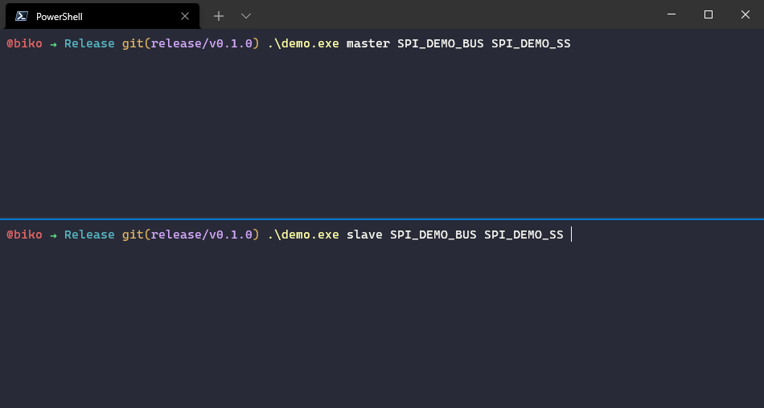

# Serial Process Interface

It's [SPI](https://en.wikipedia.org/wiki/Serial_Peripheral_Interface) for inter-process
communication.
Inspired by [EventPipe](https://www.x86matthew.com/view_post?id=eventpipe)
from x86matthew.

## Why?

Why not?

## How?

Instead of electrical wires we're using Windows event objects. The master side
(see [`spi_master.hpp`](ipc/spi_master.hpp)) bit-bangs the SCLK and MOSI "lines"
to transmit data to the slave side. The slave side
(see [`spi_slave.hpp`](ipc/spi_slave.hpp)) monitors the SCLK line
(using `WaitForSingleObject`) to synchronize with the master, and bit-bangs the MISO
line.

See the [demo](demo/main.cpp) for a usage example.
